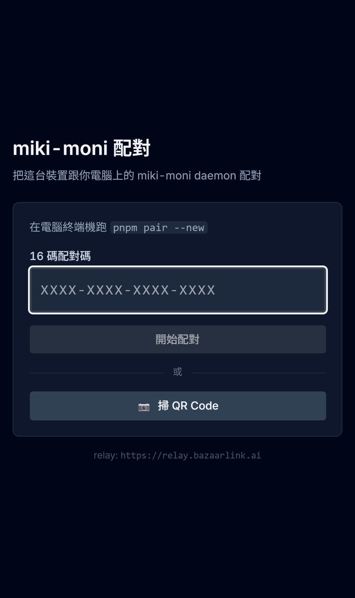
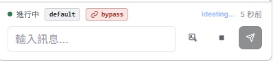

# Miki-Moni

**[English](README.md) · [繁體中文](README.zh-TW.md) · [简体中文](README.zh-CN.md)**

> 巫女 (Miki the Monitor) — 看着你所有 Claude Code session，要回应的时候叫你。

把散落在各个 VSCode 窗口的 Claude Code panel 收进一张本机仪表板，手机或第二台笔电可以通过端对端加密 relay 连进来。

<p align="center">
  
  <br />
  <em>本机 dashboard：<code>http://127.0.0.1:8765</code></em>
</p>

<table>
<tr>
<td align="center" width="33%">
  
  <br /><em>手机 dashboard（移动设备）</em>
</td>
<td align="center" width="33%">
  
  <br /><em>手机配对画面 — 扫 QR 或输入 16 码</em>
</td>
<td align="center" width="33%">
  
  <br /><em><code>miki start</code> 每次启动打印 QR + URL + 16 码</em>
</td>
</tr>
</table>

---

## v0.3.0 新功能

- **动态切模型** — 每张 session 卡都有 Model chip，点开可以中途切 default / Sonnet / Opus / Haiku / 自定义 model id，改动实时同步到所有 dashboard
- **手机 UX 大改** — 聊天气泡 transcript（user 右、assistant 左）、session modal 可右滑关闭、composer 多了图片上传按钮、修好 iOS focus-zoom 跟键盘缩放、textarea 自动长高
- **模式 chip 带颜色** — `acceptEdits` 蓝、`bypass` 红，不再是死灰色
- **新 CLI popover** 加了最近 cwd 的原生下拉选单
- **手机端 transcript 控制** 折叠成一个 sliders popover（show-tool / limit / load-all / reload）

<table>
<tr>
<td align="center" width="25%">
  
  <br /><em>手机聊天气泡 transcript</em>
</td>
<td align="center" width="25%">
  
  <br /><em>动态切模型</em>
</td>
<td align="center" width="25%">
  
  <br /><em>每个模式自己的颜色</em>
</td>
<td align="center" width="25%">
  
  <br /><em>composer + 图片上传</em>
</td>
</tr>
</table>

## 为什么

- 两个 VSCode 窗口开了三个 Claude Code panel，其中一个跑完了，你 20 分钟后才发现
- 离开桌前想瞥一眼"跑完没？"但不想 VPN 进来
- 同事机器有项目，你想只读看一眼

Miki-Moni 给你**一张 dashboard** 收齐所有 Claude session（跨窗口、跨项目、跨机器），任何地方都能响应。

**任何 session 都能从任何 terminal 接管继续做。** VSCode 起的、CLI 起的都一样，editor 崩了、窗口误关、想换个 terminal 继续做 — 一句 `miki claude -r <session-uuid>` 把**完整上下文**接回来。dashboard 每张 session 卡都有一键"Open CLI"按钮；手机端就直接通过 relay 对同一个 session 继续打字。再也不会"Claude 上下文掉了" — session UUID 是耐用的把手，不是起它的那个窗口。

## 安装

```bash
npm install -g miki-moni
miki start
```

或从 source 装（要贡献 / 用未 release 的改动）：

```bash
git clone https://github.com/WarmBed/Miki-Moni
cd Miki-Moni
pnpm install
pnpm build:all
pnpm link --global       # 把 `miki` 加到 PATH
miki start
```

首次启动会跳设置 wizard：

1. **语言** — English / 繁體中文 / 简体中文
2. **Relay 模式** — 三选一：
   - **Hosted**（默认）— 用作者免费 `relay.f1telemetrystationpro.org`，零设置
   - **Self-host** — 自动部署 Cloudflare Worker + Pages 到你 CF 账号（需要 `wrangler`）
   - **Local-only** — 不连手机，只用本机 `127.0.0.1:8765`

然后打印永久配对 QR + 16 码：

```
📱 Phone pairing — scan QR, open URL, or type the 16-char code:

  [QR]

   URL:    https://miki-moni.pages.dev/#t=XXXX...&r=wss://...
   Code:   XXXX-XXXX-XXXX-XXXX
   Local:  http://127.0.0.1:8765
   (QR / URL / Code 永久有效 — `miki pair --rotate` 可换)
```

那个 QR 永久有效，每台要配对的设备扫一次就好。泄漏时 rotate 即可。

## 三种部署模式

|  | Hosted | Self-host | Local-only |
|---|---|---|---|
| **设置时间** | 0 秒 | 约 5 分钟 wizard | 0 秒 |
| **需要 CF 账号** | 否 | 是 | 否 |
| **手机可用** | 是 | 是 | 否 |
| **信任作者基础设施** | 是（[§ 安全](#安全)） | 否 | N/A |
| **流量限制** | 作者 CF 免费层（10 万 req/天） | 你自己 CF 免费层 | N/A |
| **随时切换** | `miki setup` | `miki setup` | `miki setup` |

## 架构

```
┌──────────────────────────────────────────────────────────────────────────┐
│  你的电脑                                                                  │
│  ╭─────────────────────────────────────────────────────────────╮        │
│  │  miki-moni daemon (Node, 127.0.0.1:8765)                    │        │
│  │    POST /event   GET /sessions   POST /focus /send  WS /ws  │        │
│  │     ▲                       ▲                       ▲       │        │
│  │ PS hooks            浏览器 dashboard       RelayClient       │        │
│  ╰────────────────────────────────────────────┬────────────────╯        │
│                                                │ E2E 加密 envelope        │
│                                  ╭─────────────▼────────────╮            │
│                                  │ Cloudflare Worker relay  │            │
│                                  │ (零知识：只路由密文)       │             │
│                                  ╰─────────────┬────────────╯            │
│                                                ▼                         │
│                                  ╭──────────────────────────╮            │
│                                  │ 手机 / 第二台笔电 / 平板    │            │
│                                  │  · 扫 QR → 自动配对        │            │
│                                  │  · 看到一样的 dashboard    │            │
│                                  ╰──────────────────────────╯            │
└──────────────────────────────────────────────────────────────────────────┘
```

**加密**：配对时 X25519 ECDH → per-peer shared secret → 每个 envelope 用 NaCl `secretbox`。Relay 没有 key；只有 daemon 跟配对好的手机能解内容。

**认证**：每台手机握一对 Ed25519 签名 keypair（IndexedDB）。重连时签 `daemon_id || utc_minute`，relay 验签才放行。`miki pair --revoke <peer_id>` 删单个设备。

## Dashboard 功能

上方工具栏：

| | 作用 |
|---|---|
| **计数器**（`5 进行中 · 0 闲置 · 56 总览`） | 点击筛选只看那个状态，再点取消 |
| **➕ 新增 CLI** | 在指定文件夹开新 wrapped session（`miki claude --fresh`） |
| **⚙️ 设置** | 发送键（Enter vs Ctrl/⌘+Enter）、主题（亮/暗）、语言 |
| **WS 灯号** | 绿＝实时更新中 · 黄＝重连中 |

Session 卡片：

| 元素 | 作用 |
|---|---|
| **项目名 + cwd** | 卡片标题 — 点开查看完整 transcript |
| **🖥️ VSCode / 📟 CLI 切换** | 决定 *发送 / focus* 走哪边。**VSCode**：用 `vscode://anthropic.claude-code/open?session=…` 把 prompt 预填 VSCode panel。**CLI**：直接打 wrap CLI 的 WebSocket。 |
| **权限 badge**（`✏️ auto edit` 蓝 / `🚀 bypass` 红） | 只有跑 `miki claude --permission-mode acceptEdits` / `--bypass-permissions` 的 wrap CLI session 才显示，整个 session lifetime 锁定不能改。每个模式自己的颜色 |
| **Model chip** ⭐ | 点开即时切模型 — default / Sonnet / Opus / Haiku / 自定义 id。改动广播到所有 dashboard。底层走 `POST /wrap/model` |
| **Transcript view** | 聊天气泡版面（user 右、assistant/system/tool 左）。可开关 tool call。滚动门槛 10 / 50 / 200 / 全部。手机端控制折叠成一个 sliders popover |
| **发送输入框** | 多行 prompt，自动长高。Enter 或 Ctrl/⌘+Enter 发送（按你的设置）。支持粘贴/拖图片**或**按钮选档（手机友好） |
| **右滑关闭**（手机） | session modal 往右拖即可关掉；document 层级手势 + translateX 预览 |
| **开 CLI 按钮** ⭐ | **从 CLI 接管这个 session，完整上下文都在。** 开 `wt.exe`（Windows Terminal）跑 `miki claude -r <session-uuid>` — Claude 从 VSCode panel 停的那回合接着做。原本从哪起的都不重要；panel 可以已关、已 crash、在另一个窗口。配上手机 dashboard，同一个 session 你在哪都能继续打 |
| **Focus 按钮** | `POST /focus` — 把对应 VSCode 窗口（或 CLI tab）提到最前 |

## CLI 命令

| 命令 | 用途 |
|---|---|
| `miki start` | 跑 daemon + 打印配对 banner。第一次跑会跳 wizard |
| `miki setup` | 重跑 wizard（换语言、切 relay 模式等） |
| `miki pair` | 打印当前永久 QR + 已配对手机清单 |
| `miki pair --rotate` | 换新 token（旧 QR 失效；已配对手机照常工作） |
| `miki pair --list` | 列已配对手机 |
| `miki pair --revoke <peer_id>` | 删除某台手机（本机 config + relay 都清） |
| `miki pair --new` | 一次性 token（10 分钟 TTL）— 旧机制 / debug 用 |
| `miki claude [...args]` | 包一个 Claude session，daemon 没跑会自动起 |
| `miki install-hooks` | 把 Claude Code hooks 装进 `~/.claude/settings.json`，没 wrap 的 panel 也会出现在 dashboard |

启动时看详细 log：`MIKI_LOG_LEVEL=info miki start`。完整 trace 永远在 `~/.miki-moni/miki-moni.log`。

## 安全

### 手机能做什么、不能做什么

刻意把手机端能力压到最小，威胁模型才好顾：

| 手机**可以** | 手机**不可以** |
|---|---|
| 看实时 session 状态 + transcript | 在你电脑上跑任意 shell 命令 |
| Pre-fill prompt 进 VSCode panel（`/focus`） | 不经你 VSCode 按键自动送出 prompt（Anthropic 设计） |
| 对 `miki claude` 起的 session 从 wrap CLI WebSocket 推 prompt | 开新 process 或读 session 外的文件 |
| Focus 已存在的 panel | 绕过 Claude Code 工具权限提示（每个工具调用一样会问你） |

### 信赖边界

daemon **只绑 `127.0.0.1`** — 公网永远戳不到。远端走加密 relay，不走本机 HTTP port。

daemon 信任**所有跟你同账号**的本机程序去打 `/event`、`/send`、`/focus`、`/ws_ext`。这是故意的（Claude Code hooks 跟 VSCode helper extension 才不用带 token），但代价是：**任何以你身份跑的程序都能跟 daemon 讲话**。完整本机信赖分析跟硬化选项见 [`docs/security/hooks-trust-model.md`](docs/security/hooks-trust-model.md) 跟 [`docs/security/extension-ws-trust-model.md`](docs/security/extension-ws-trust-model.md)。

### 风险表

按可能性排序：

| 风险 | 缓解 |
|---|---|
| 🔴 **配对 QR 泄漏**（截图、贴到聊天室、被路人拍） | 永久 QR = 任何人扫到都能 pair。把 QR 当 SSH key 看待。泄漏立刻 rotate：`miki pair --rotate` |
| 🟡 **配对手机被偷** | 手机握 Ed25519 签名 key 才能连 relay。从 daemon 删：`miki pair --revoke <peer_id>` |
| 🟡 **本机被入侵** | daemon 信任 loopback。任何以你身份跑的恶意程序可读 session、可从 `/ws_ext` 拦 prompt。`~/.miki-moni/`（私钥、配对记录）请当 `~/.ssh/` 那样保护 |
| 🟢 暴力猜 token | 16 字符 Crockford base32 ≈ 80 bits entropy，宇宙热寂前猜不到 |
| 🟢 Relay 看到内容 | 零知识架构 — relay 只路由密文，不持有 shared secret |
| 🟡 信任 hosted relay 维护者 | Self-host 完全摆脱这层信任。作者看得到 metadata（peer ID、时间、大小），理论上可改 PWA bundle。源码公开，可自行 audit 或 self-host。 |
| 🟢 Hosted relay 被 DDoS | Cloudflare rate limit 限 30 req/60 秒/IP。最坏：你的当日配额烧光 |

## Self-host（手动）

`miki setup` wizard 自动做完，但要手动的话：

```bash
# 在 clone 好的 cc-hub source 树：
cd worker
wrangler login
wrangler deploy --config wrangler-selfhost.toml --name my-relay
wrangler pages project create my-phone --production-branch=main
wrangler pages deploy ../dist/web-phone --project-name my-phone --branch=main
```

然后编 `~/.miki-moni/config.json`：

```json
{
  "remote": {
    "worker_url": "wss://my-relay.<你 CF 账号>.workers.dev",
    "phone_pwa_url": "https://my-phone.pages.dev/"
  }
}
```

下次 `miki start` 就会用新 endpoints。

## 开发

```bash
git clone https://github.com/WarmBed/Miki-Moni
cd Miki-Moni
pnpm install
pnpm typecheck
pnpm test         # daemon + worker tests
pnpm dev          # tsx watch src/index.ts
```

Source 结构：

| 路径 | 用途 |
|---|---|
| `src/` | Node daemon（express + ws + better-sqlite3）— hooks、配对、RelayClient |
| `web/` | 桌面 / 手机完整 dashboard（Preact + Tailwind + Vite） |
| `web-phone/` | 手机 bootstrap（QR 扫描器 + tunnel 设置）— mount web/ |
| `worker/` | Cloudflare Worker relay（DaemonRelay + PairingCoordinator DOs） |
| `extension/` | VSCode helper extension — handle `claude-vscode.send` |
| `hooks/` | Claude Code hook 脚本（PowerShell）— POST event 到 daemon |
| `bin/miki.mjs` | npm 发布的 CLI 入口 |

## 分支

- `main` — 版本化 release（当前：v0.3.3）
- `dev` — 开发中；每改动 bump `package.json` version

## 相关项目

**[Happy](https://happy.engineering)**（`slopus/happy-cli`, MIT）切的痛点有重叠 — 从手机操控 Claude Code — 但角度不同。两者可以同一台机器并存。

|  | Miki-Moni | Happy |
|---|---|---|
| 主入口 | VSCode panel — hooks 把每个 panel 拉进 dashboard | 取代 `claude` 的 terminal wrapper |
| Relay | Cloudflare Worker；可以 5 分钟 self-host 到自己 CF 账号 | 作者自架 socket.io server（`api.cluster-fluster.com`） |
| 手机端 | Web PWA — 扫 QR 就能用，免装 app | 原生 iOS / Android app |
| 支持 agent | Claude Code | Claude Code、Codex、Gemini、通用 ACP |
| 语音输入 | — | 有 |
| 多 session 可视化 dashboard | 有 — 跨窗口聚合 | 各 session 独立管 |
| 取代 `claude` 吗 | 不取代 — hooks 并存 | 取代，自己 spawn `claude` |
| 远端 spawn（人不在桌前也能起新 session） | — | 有（`happy daemon`） |
| 加密 relay | 有（X25519 + NaCl secretbox） | 有（X25519 + NaCl secretbox + AES-GCM） |

想要打磨好的手机原生体验、跨多个 AI agent、不介意 SaaS relay → 用 Happy。住在 VSCode 里、想要一张 dashboard 收齐多个并行 panel、想 self-host 到自己 CF → 用 Miki-Moni。

## 许可证

MIT — 见 [LICENSE](LICENSE)。

## Credits

用 [Anthropic Claude](https://claude.ai/code) 通过 [Claude Code](https://github.com/anthropics/claude-code) 写出来的。
