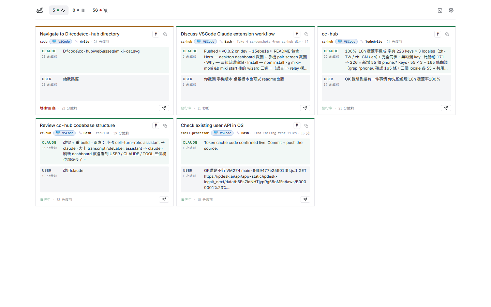
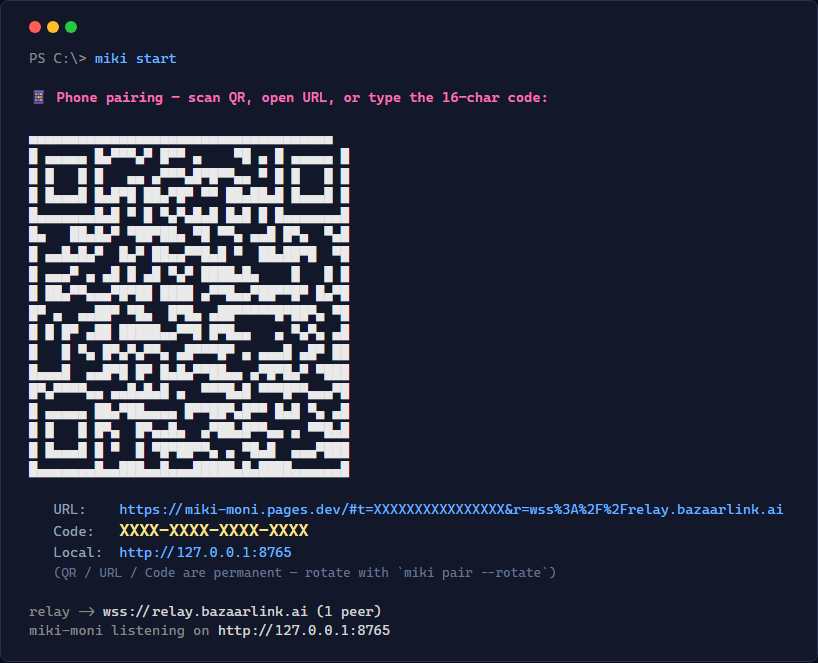
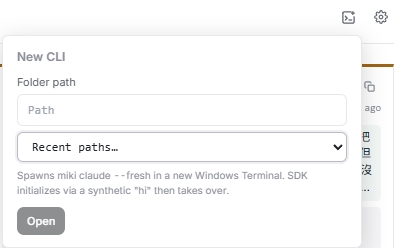
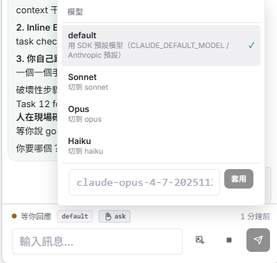
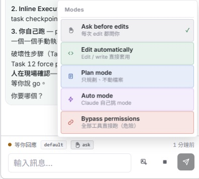
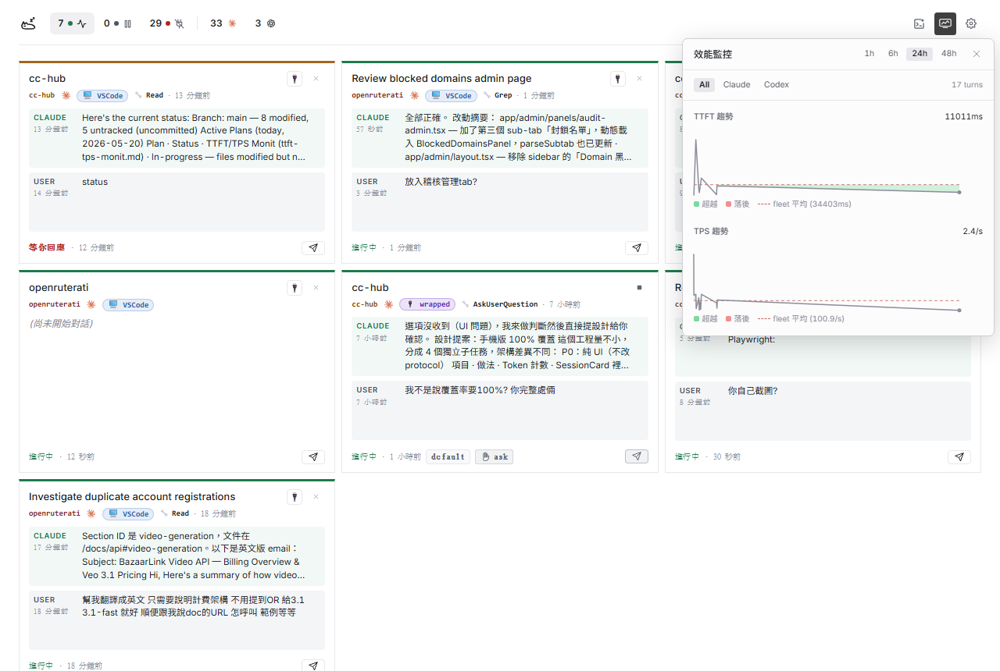
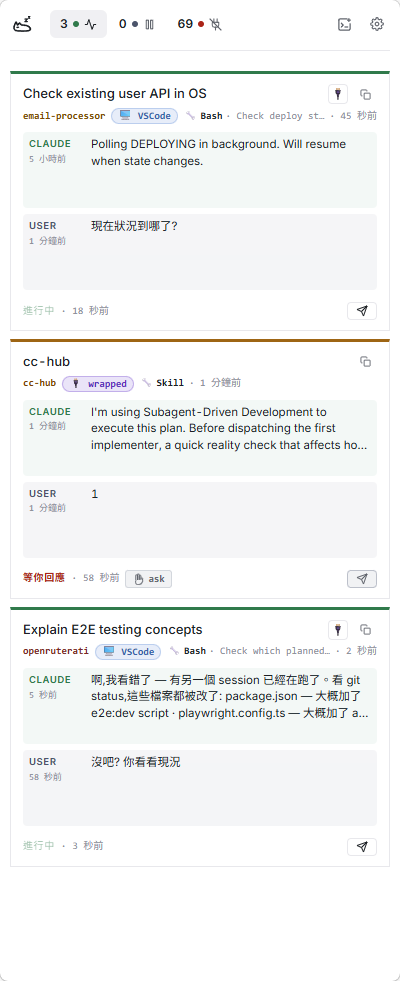
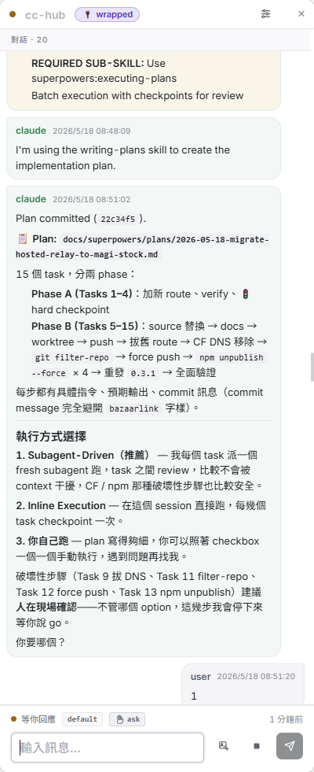

# Miki-Moni

**[English](README.md) · [繁體中文](README.zh-TW.md) · [简体中文](README.zh-CN.md)**

> 巫女 (Miki the Monitor) — 一张 dashboard 收齐你所有 Claude Code session，可端对端加密从手机遥控。

<p align="center">
  
</p>

<p align="center">
  <a href="#快速开始">安装</a> ·
  <a href="#架构">架构</a> ·
  <a href="#self-host">Self-host</a> ·
  <a href="#安全">安全</a>
</p>

---

## 这是什么

你同时开了好几个 Claude Code panel。其中一个跑完了，你 20 分钟后才发现。你离开桌前想瞄一眼"跑完没？"，但不想 VPN 进来。同事机器上有 context，你想只读看一眼。

Miki-Moni 用 hooks 串接每一个 Claude Code panel，把它们聚合到本机 `http://127.0.0.1:8765` 一张 dashboard 上。要的话，加密 relay 让手机或第二台电脑看到同一个画面，并能推 prompt 回来。

- **聚合，不是取代。** Hooks 跟 `claude` 并存 — 你照原本方式起 session
- **同一个对话，跨任何设备。** 在电脑 A 起的对话，路上用手机继续打，回家再用电脑 B 接着做 — 同一个 session UUID、同一份 transcript、同一份 context。不用把进度贴到新 prompt 里
- **Session 撑得比窗口久。** 任何 session 都能用 UUID 从任何 terminal 接回完整 context：`miki claude -r <uuid>`，原本的 panel 已关 / crash 都不影响
- **默认纯本机，自己选才走远端。** Daemon 只绑 `127.0.0.1`。手机端走端对端加密 envelope，relay 不持有任何 key

## 快速开始

```bash
npm install -g miki-moni
miki start
```

首次启动跑 wizard：选语言、选 relay 模式（hosted / self-host / local-only）、打印永久配对 QR：

<p align="center">
  
</p>

每台要配对的设备扫一次 QR 就好。Token 永久有效，除非你 `miki pair --rotate`。Dashboard 在 [http://127.0.0.1:8765](http://127.0.0.1:8765)。

## 架构

```
┌─ 你的电脑 ─────────────────────────────────────────────────────────────┐
│                                                                        │
│  Claude Code（任何 panel）                                             │
│   │                                                                    │
│   │ PS hooks（SessionStart / Stop / UserPromptSubmit / PreToolUse /    │
│   │            PostToolUse）                                           │
│   │  ── POST /event ──▶                                                │
│   │                                                                    │
│   │   ┌──────────────────────────────────────────────────────────┐    │
│   │   │  miki-moni daemon（Node, 127.0.0.1:8765）                │    │
│   │   │  ─ session 存储（better-sqlite3）                         │    │
│   │   │  ─ HTTP：/event /sessions /focus /send /wrap/*           │    │
│   │   │  ─ WS：  /ws（dashboard） /wrap（CLI） /ws_ext（ext）    │    │
│   │   │  ─ RelayClient（X25519 + NaCl secretbox）                │    │
│   │   └─────┬──────────────┬────────────────┬───────────┬───────┘    │
│   │         │ WS /ws       │ WS /ws_ext     │ WS /wrap  │ relay      │
│   ▼         ▼              ▼                ▼           │ envelope   │
│  hooks    浏览器 dashboard  VSCode helper   miki claude │            │
│           （Preact SPA）   extension       （wrap CLI）  │            │
│                                                          │            │
└──────────────────────────────────────────────────────────┼────────────┘
                                                           │
                                       ╭───────────────────▼──────────╮
                                       │ Cloudflare Worker relay      │
                                       │ （零知识：只路由不透明 blob，│
                                       │   不持有任何 key）            │
                                       ╰───────────────────┬──────────╯
                                                           │ E2E 加密
                                                           ▼
                                       ╭──────────────────────────────╮
                                       │ 手机 PWA / 第二台电脑         │
                                       │ Ed25519 keypair 存 IndexedDB │
                                       ╰──────────────────────────────╯
```

| 组件 | 角色 |
|---|---|
| **PS hooks** | Claude Code 在 session / tool 边界 POST 到 `/event`，没 wrap 的 panel 也会被 dashboard 看到 |
| **daemon** | Node + express + ws + better-sqlite3。持有 session 状态，路由四个 WS 平面 |
| **浏览器 dashboard** | Preact + Tailwind SPA 挂在 `/`。读 `/ws`，POST `/send` 跟 `/focus` |
| **wrap CLI**（`miki claude`） | 包一个 Claude Code session，让 daemon 能推 prompt（`/send`）、切模型（`/wrap/model`）、用 UUID resume |
| **VSCode helper extension** | 连 `/ws_ext`；接收 `claude-vscode.focus` 把 prompt 预填进当前 panel |
| **RelayClient** | E2E 加密 envelope（每个 peer 一对 X25519 ECDH → NaCl secretbox），打到 Worker |
| **Cloudflare Worker** | Stateless relay。在 daemon 跟配对 peer 之间路由密文。校验 `daemon_id ‖ utc_minute` 的 Ed25519 签名 |
| **手机 PWA** | Web client 从 Pages 出。扫 QR，IndexedDB 存 Ed25519 签名 key，跟 relay 沟通 |

完整协议见 [`docs/protocols/relay-protocol.md`](docs/protocols/relay-protocol.md)。

## 功能

### Dashboard

- **多 session 网格** — 本机上每一个 Claude Code panel，不管哪个 VSCode 窗口或 terminal 起的都收进来
- **状态计数器可筛选** — 点 `5 进行中` 把网格收敛到那个状态，再点取消
- **New CLI popover** — 在任意文件夹起一个全新的 `miki claude --fresh`；最近用过的 cwd 用原生下拉记着，跳新项目一键搞定
- **实时 transcript** 用聊天气泡版面（user 右、assistant/system/tool 左）。可切 tool call 显示，滚动门槛 10 / 50 / 200 / 全部
- **WS 灯号** — 绿 = 实时接收中，黄 = 重连中

<p align="center">
  
</p>

### Session 控制

- **Model chip** — 点开实时切模型：default / Sonnet / Opus / Haiku / 自定义 id。通过 `POST /wrap/model` 广播到每张 dashboard
- **Mode chip 带颜色** — `acceptEdits` 蓝、`bypass` 红、ask 灰。整个 session lifetime 锁定
- **Open CLI** — 开 `wt.exe` 跑 `miki claude -r <session-uuid>`，从 terminal 接管 session 带完整 context。原本的 panel 已关或 crash 都不影响
- **发送输入框** — 多行输入自动长高。Enter 或 Ctrl/⌘+Enter 发送（按你的设置）。支持粘贴、拖拽、按钮选图片附件

<p align="center">
  
  
</p>

### 性能监控

- **TTFT 折线图** — 每个 `miki claude` wrap session 的 Time-to-First-Token（ms），追踪 Claude 开始回复的速度
- **TPS 折线图** — streaming 期间每秒字符数，一眼看出模型或网络劣化
- **Fleet 平均线** — 虚线显示 48 小时滚动平均，让单次数据有参照基准
- **时间窗选择** — 1h / 6h / 24h / 48h 滚动视窗，无需重新加载即可切换
- **手机同等** — 手机端点击 ⚡ Monit 按钮，通过加密 relay proxy 查看同样的图表

<p align="center">
  
</p>

> **注意：** TTFT / TPS 数据只在 `miki claude`（wrap 模式）起的 session 中收集。纯 hook 模式的 session 会出现在 dashboard 上，但不产生性能指标。

### 手机

- **手机 dashboard** — 一样的网格，单列、移动设备友好的点击区
- **聊天气泡 transcript** 跟桌面同步，适配手机 viewport
- **右滑关闭** session modal — document 层级手势 + translateX 预览
- **Composer** 带图片上传按钮（手机 file picker）、textarea 自动长高、修好 iOS focus-zoom 跟键盘缩放
- **Transcript 控制可折叠**（show-tool / limit / load-all / reload）藏在一个 sliders popover 里

<p align="center">
  
  
</p>

## 部署模式

|  | Hosted | Self-host | Local-only |
|---|---|---|---|
| 设置时间 | 0 秒 | 约 5 分钟 wizard | 0 秒 |
| 需要 CF 账号 | 否 | 是 | 否 |
| 手机可连 | 是 | 是 | 否 |
| 信任作者基础设施 | 是 | 否 | N/A |
| 流量上限 | 作者 CF 免费层（约 10 万 req/天） | 你自己 CF 免费层 | N/A |
| 之后可切换 | `miki setup` | `miki setup` | `miki setup` |

默认是 **Hosted**，指向 `relay.f1telemetrystationpro.org`。选 Self-host 时 wizard 会把 Worker + Pages 部署到你的 CF 账号。

## 安全

Daemon **只绑 `127.0.0.1`** — 公网永远戳不到。手机端走端对端加密：配对时 X25519 ECDH，每个 envelope NaCl `secretbox`。加密用的私钥永远不离开 daemon 跟配对好的手机。

Daemon 信任**所有以你身份跑的进程**去调用 `/event`、`/send`、`/focus`、`/ws_ext`。这让 hooks 跟 helper extension 不用带 token，但代价是：任何以你身份跑的进程都能跟 daemon 讲话。`~/.miki-moni/` 请当 `~/.ssh/` 那样保护。

### 手机能 / 不能做什么

| 手机**可以** | 手机**不可以** |
|---|---|
| 看实时 session 状态 + transcript | 在你电脑上跑任意 shell 命令 |
| 推 prompt（pre-fill 进 VSCode、直送 wrap CLI） | 不经你 VSCode 按键就自动送出 prompt |
| Focus 已存在的 panel | 绕过 Claude Code 每个工具的权限提示 |

### Relay 看得到 / 看不到什么

daemon 跟手机之间全程走 WSS（到 CF edge 为止都是 TLS）。Worker 在 edge 解 TLS 之后看到的：

| Relay (Worker) **看得到** | Relay **看不到** |
|---|---|
| Daemon 的公钥（Ed25519 + X25519） | **消息内容**（每个 envelope 都是 NaCl `secretbox` 在两端加密） |
| Pairing token（配对那一刻，用完即丢） | 私钥（X25519 / Ed25519 留在 daemon 跟手机 — 手机侧存在 IndexedDB） |
| 手机公钥 + reconnect 签名 | 你打了什么、Claude 回了什么、transcript、tool I/O |
| Metadata：谁跟谁配对、连线时间、envelope 大小、peer ID | |

Hosted relay 模式下这些 metadata 运维者（作者 + Cloudflare）看得到。Self-host 就避开这层 — 运维者变你自己。

### Relay 唯一现实的攻击路径：PWA bundle swap

手机端是从 Cloudflare Pages 出的 PWA。被攻陷的 relay 运维者可以**推一份恶意 bundle**，在首次加载时把手机 IndexedDB 里的 X25519 私钥偷走。端对端加密的安全性最后还是取决于两端跑的代码。缓解：

- **Self-host** — Worker 跟 Pages bundle 都你掌控
- **Pin bundle** — 在已知干净的日子配对，然后关掉 PWA 自动更新（看 browser）
- **看 source** — Pages bundle 可以从这个 repo 对应 daemon 版本的 tag 重现

风险表、硬化选项、完整 hooks / extension 信赖分析见 [`docs/security/`](docs/security/)。

## CLI 命令

| 命令 | 用途 |
|---|---|
| `miki start` | 跑 daemon；首次启动会跳 wizard |
| `miki setup` | 重跑 wizard（换语言、切 relay 模式） |
| `miki pair` | 打印永久 QR + 已配对手机列表 |
| `miki pair --rotate` | 换新 token（旧 QR 失效；已配对手机照常工作） |
| `miki claude [...args]` | 包一个 Claude Code session，daemon 没跑会自动起 |
| `miki install-hooks` | 把 Claude Code hooks merge 进 `~/.claude/settings.json` |

完整列表见 `miki --help`。详细 log：`MIKI_LOG_LEVEL=info miki start`，完整 trace 永远在 `~/.miki-moni/miki-moni.log`。

## Self-host

Wizard 会做完全程；要手动部署：

```bash
cd worker
wrangler login
wrangler deploy --config wrangler-selfhost.toml --name my-relay
wrangler pages project create my-phone --production-branch=main
wrangler pages deploy ../dist/web-phone --project-name my-phone --branch=main
```

然后把 `~/.miki-moni/config.json` 指到你的 endpoint：

```json
{
  "remote": {
    "worker_url": "wss://my-relay.<你的 cf 账号>.workers.dev",
    "phone_pwa_url": "https://my-phone.pages.dev/"
  }
}
```

## 开发

```bash
git clone https://github.com/WarmBed/Miki-Moni
cd Miki-Moni
pnpm install
pnpm dev          # tsx watch src/index.ts
pnpm test         # daemon + worker tests
pnpm typecheck
```

Source tree：`src/` daemon · `web/` dashboard SPA · `web-phone/` 手机 bootstrap · `worker/` Cloudflare Worker · `extension/` VSCode helper · `hooks/` PS hook scripts · `bin/miki.js` CLI 入口。

Branch：`main` 出 release（当前 **v0.3.18**），`dev` 跑开发、每个改动 bump `package.json`。

## 相关项目

**[Happy](https://happy.engineering)**（`slopus/happy-cli`）切的痛点有重叠但角度不同，两者可同机并存。

| | Miki-Moni | Happy |
|---|---|---|
| 入口 | hooks 进现有 panel | 取代 `claude` |
| 手机端 | Web PWA（免装） | 原生 iOS / Android |
| 多 session dashboard | 有 — 聚合网格 | 各 session 独立 |
| 支持 agent | Claude Code | Claude Code、Codex、Gemini、ACP |

想要打磨好的手机原生体验、跨多个 AI agent → 用 Happy。住在 VSCode 里、想要一张 dashboard 收齐每个 panel、想几分钟 self-host → 用 Miki-Moni。

## License

MIT — 见 [LICENSE](LICENSE)。

## Credits

用 [Anthropic Claude](https://claude.ai/code) 通过 [Claude Code](https://github.com/anthropics/claude-code) 写出来的。
